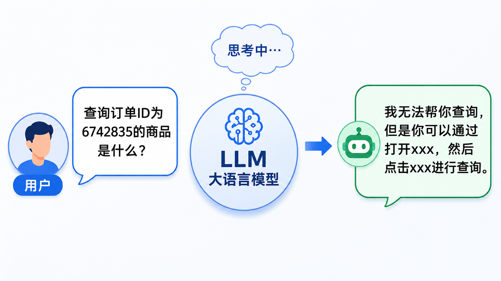
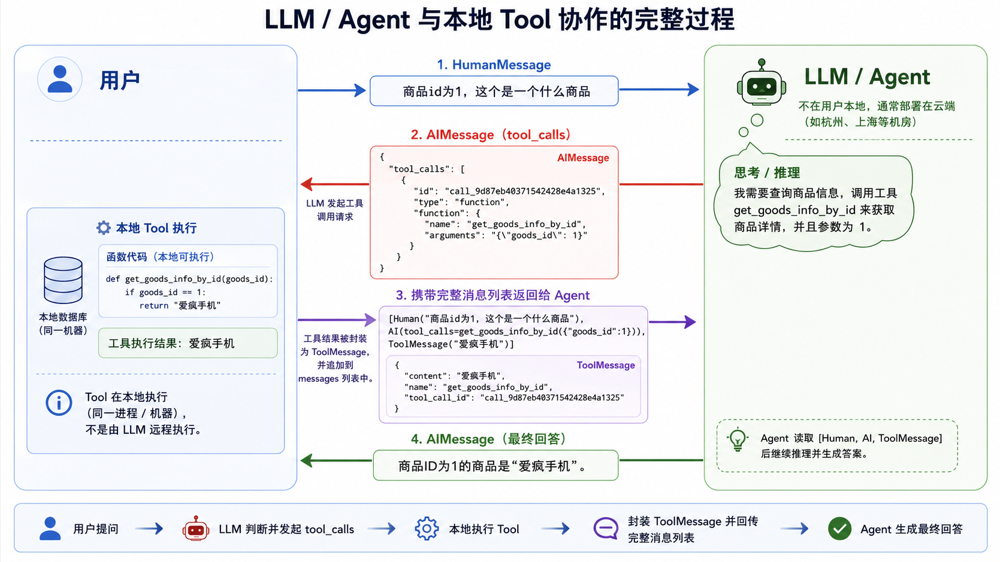

# 「数析」智能数据分析台

## 1. Agent 基础

### 1.1. LLM 短板

**1. 回顾LLM：一个“只动口”的推理引擎**

从之前的代码可以看出，LLM 的典型使用模式是：

```python
llm.invoke(question)   # 一次性调用，一问一答
llm.stream(question)   # 流式输出，一问一答
```

​		你问 LLM 一句，然后它回答一句。这揭示了一个本质：**LLM 是一个被动响应的文字推理引擎**。它的能力范围仅限于**理解输入文本**（推理、总结、翻译）和**生成输出文本**。

​		它没有内在的目标，也不会主动去“做什么”——你问一句，它答一句。任务在输出文本后便结束。

**2. LLM 的最大短板：能思考，但不能行动**

现实中的许多问题，仅靠“输出文字”是无法解决的。例如：

- “帮我查一下明天的天气并写进备忘录”
- “查询订单ID为6742835的商品是什么？”

对于这些**实时查询数据**都需要去查询对应的接口，比如`天气查询接口`，`后台订单ID查询接口`。但是 LLM 无法帮助我们去查询接口，**无法帮我们做事情，只能说不能做**，这就有点无语了。



### 1.2. Agent 介绍

为了解决 LLM 无法执行实际任务的问题，引入 **Agent（智能体）**。

**智能体的本质**：Agent = LLM（推理大脑） + 三大关键能力。

**三大关键能力**：

1. **自主规划** – 将复杂目标拆解为可执行步骤。
2. **工具调用** – 主动调用外部 API / 搜索 / 代码解释器。（即：Agent 可以自己去调用我们的函数，去执行某个任务！）
3. **记忆机制** – 保留历史信息与中间结果，支持动态决策。

**一句话总结**：Agent 让 LLM 从“只会说”进化为“能够做”

## 2. Agent 创建

### 2.1. 快速创建一个 Agent

[data-analysis/test/agent/2_Agent查询订单信息.ipynb](https://gitee.com/he-wenlin/k-ai-knowledge/blob/master/data-analysis/test/agent/2_Agent查询订单信息.ipynb)

### 2.2. 如何给工具提供描述信息

**规则**：工具必须提供描述信息，否则会报错：

```python
ValueError: Function must have a docstring if description not provided.
```

**原因**：LLM（Agent 的大脑）需要依赖工具描述来判断：

- 该工具是做什么的
- 什么情况下应该调用它

如果没有描述，LLM 无法根据用户意图选择正确的工具。

**结论**：为每个工具编写清晰的描述（docstring 或显式 description），是 Agent 能够正确调用工具的前提。

### 2.3. Agent 调用工具的完整流程

```python
messages (list)
├── [0] HumanMessage
│   ├── content: "商品id为1，这个是一个什么商品"
│   ├── additional_kwargs: {}
│   ├── response_metadata: {}
│   └── id: "ffb06172-745c-4375-8af1-81386739510d"
│
├── [1] AIMessage
│   ├── content: ""
│   ├── additional_kwargs
│   │   └── tool_calls: list
│   │       └── [0]
│   │           ├── function
│   │           │   ├── arguments: '{"goods_id": 1}'
│   │           │   └── name: "get_goods_info_by_id"
│   │           ├── id: "call_9d87eb40371542428e4a1325"
│   │           ├── index: 0
│   │           └── type: "function"
│   ├── response_metadata
│   │   ├── model_name: "qwen3-max"
│   │   ├── finish_reason: "tool_calls"
│   │   ├── request_id: "db6f8f43-2547-9f1e-b1b9-9a063cd28613"
│   │   └── token_usage
│   │       ├── input_tokens: 289
│   │       ├── output_tokens: 25
│   │       ├── prompt_tokens_details
│   │       │   └── cached_tokens: 0
│   │       └── total_tokens: 314
│   ├── id: "lc_run--019e9101-2ea6-7750-b1e6-c05abd70fc1b-0"
│   ├── tool_calls: list
│   │   └── [0]
│   │       ├── name: "get_goods_info_by_id"
│   │       ├── args: {"goods_id": 1}
│   │       ├── id: "call_9d87eb40371542428e4a1325"
│   │       └── type: "tool_call"
│   └── invalid_tool_calls: []
│
├── [2] ToolMessage
│   ├── content: "爱疯手机"
│   ├── name: "get_goods_info_by_id"
│   ├── id: "8175320e-a3f3-4a26-b4b6-3855d0e37482"
│   └── tool_call_id: "call_9d87eb40371542428e4a1325"
│
└── [3] AIMessage
    ├── content: "商品ID为1的商品是“爱疯手机”。"
    ├── additional_kwargs: {}
    ├── response_metadata
    │   ├── model_name: "qwen3-max"
    │   ├── finish_reason: "stop"
    │   ├── request_id: "383427a2-cd7c-9651-a3e7-40bdd0c1bc91"
    │   └── token_usage
    │       ├── input_tokens: 332
    │       ├── output_tokens: 11
    │       ├── prompt_tokens_details
    │       │   └── cached_tokens: 192
    │       └── total_tokens: 343
    ├── id: "lc_run--019e9101-34eb-7391-8415-7ca51a3e45bb-0"
    ├── tool_calls: []
    └── invalid_tool_calls: []
```

Agent 调用工具的完整流程：



**1. 你问了一个问题**
你问：“商品id为1，这个是什么商品？”
这就是图里的 **HumanMessage**。

**2. LLM（大脑）听到后开始想**
它一看：“哦，用户想知道商品信息，但我自己不知道啊。不过我记得有一个工具叫 `get_goods_info_by_id`，可以帮我查。”
于是它决定：**“我要调用这个工具，参数 goods_id = 1。”**
它并不自己查，而是输出一个“指令”——这就是 **AIMessage（tool_calls）**。
那个 JSON 里面写清楚了：调用哪个工具、传什么参数。

**3. 本地的 Agent 框架拿到这个指令**
它一看：“好的，大脑让我执行 `get_goods_info_by_id(1)`。”
于是它在**本地（同一台机器或同一个进程）**真真实实地跑了一下这个 Python 函数：

```python
def get_goods_info_by_id(goods_id):
    if goods_id == 1:
        return "爱疯手机"
```

结果就是 **“爱疯手机”**。
然后把结果包装成一个 **ToolMessage**，里面包含内容和对应的 `tool_call_id`，告诉大脑：“这是刚才那个调用的结果。”

**4. 把整个对话历史再发给 LLM（大脑）**
现在消息列表变成了：

- 你问的：“商品id为1是什么”
- 大脑刚才说要调用工具的那个指令
- 工具返回的结果：“爱疯手机”

大脑看到这个消息列表后，就懂了：“哦，原来商品1是爱疯手机。”
于是它生成最终回答：**“商品ID为1的商品是‘爱疯手机’。”**
这就是最后的 **AIMessage（最终回答）**。

## 3. ReAct 思想

### 3.1. ReAct 案例

在`2.3. Agent 调用工具的完整流程`中，展示了Agent调用一个工具的全过程，那么如果有多个工具，Agent 又该会如何调用呢？
代码展示：根据商品名称去查询商品ID，然后根据商品ID查询商品价格。

```python
# 准备数据
product_db = {
    "iPhone": {"id": 101, "price": 5999},
    "MacBook": {"id": 102, "price": 12999},
    "小米手机": {"id": 103, "price": 3999},
}

# 工具1：根据名称获取ID
@tool(description="根据商品名称获取对应的商品ID")
def get_product_id_by_name(name: str) -> int | None:
    """输入商品名称（如'iPhone'），返回商品ID"""
    name_lower = name.lower()
    for prod_name, info in product_db.items():
        if prod_name.lower() == name_lower:
            print(f"[工具A] 商品 '{name}' 的 ID 是 {info['id']}")
            return info['id']
    print(f"[工具A] 未找到商品 '{name}'")
    return None

# 工具2：根据ID获取价格
@tool(description="根据商品ID查询商品价格")
def get_product_price_by_id(product_id: int) -> str | None:
    """输入商品ID，返回价格字符串"""
    for prod_name, info in product_db.items():
        if info['id'] == product_id:
            price = info['price']
            print(f"[工具B] ID {product_id} 的商品 '{prod_name}' 价格为 {price} 元")
            return f"{prod_name} 的价格是 {price} 元"
    print(f"[工具B] 未找到 ID {product_id} 对应的商品")
    return None
```

方法查询路径：商品名称 -> 调用`get_product_id_by_name` 获取商品ID->调用`get_product_price_by_id`获取商品价格。

---

结果如下：

```python
{
  "messages": [
    {
      "type": "HumanMessage",
      "content": "我想知道小米手机的价格是多少？",
      "additional_kwargs": {},
      "response_metadata": {},
      "id": "afcff753-192c-4843-8591-93dac8f160d3"
    },
    {
      "type": "AIMessage",
      "content": "",
      "additional_kwargs": {
        "tool_calls": [
          {
            "function": {
              "arguments": "{\"name\": \"小米手机\"}",
              "name": "get_product_id_by_name"
            },
            "id": "call_058c3eeeb3b946e1a1ca8cca",
            "index": 0,
            "type": "function"
          }
        ]
      },
      "response_metadata": {
        "model_name": "qwen3-max",
        "finish_reason": "tool_calls",
        "request_id": "75e60ea1-5f80-9de1-bbfd-45910ec25fe8",
        "token_usage": {
          "input_tokens": 368,
          "output_tokens": 24,
          "prompt_tokens_details": {
            "cached_tokens": 256
          },
          "total_tokens": 392
        }
      },
      "id": "lc_run--019e9152-461d-7791-a1c5-e0c4a9d1f25d-0",
      "tool_calls": [
        {
          "name": "get_product_id_by_name",
          "args": {
            "name": "小米手机"
          },
          "id": "call_058c3eeeb3b946e1a1ca8cca",
          "type": "tool_call"
        }
      ],
      "invalid_tool_calls": []
    },
    {
      "type": "ToolMessage",
      "content": "103",
      "name": "get_product_id_by_name",
      "id": "9fbb2fcb-1b75-4c3b-856f-1bf002362db6",
      "tool_call_id": "call_058c3eeeb3b946e1a1ca8cca"
    },
    {
      "type": "AIMessage",
      "content": "",
      "additional_kwargs": {
        "tool_calls": [
          {
            "function": {
              "arguments": "{\"product_id\": 103}",
              "name": "get_product_price_by_id"
            },
            "id": "call_cfa4c9876707483eb297904e",
            "index": 0,
            "type": "function"
          }
        ]
      },
      "response_metadata": {
        "model_name": "qwen3-max",
        "finish_reason": "tool_calls",
        "request_id": "4e310a02-5b28-980a-a7db-d4440797c7a6",
        "token_usage": {
          "input_tokens": 410,
          "output_tokens": 27,
          "prompt_tokens_details": {
            "cached_tokens": 0
          },
          "total_tokens": 437
        }
      },
      "id": "lc_run--019e9152-4b76-7762-b2bd-191ce376ab85-0",
      "tool_calls": [
        {
          "name": "get_product_price_by_id",
          "args": {
            "product_id": 103
          },
          "id": "call_cfa4c9876707483eb297904e",
          "type": "tool_call"
        }
      ],
      "invalid_tool_calls": []
    },
    {
      "type": "ToolMessage",
      "content": "小米手机 的价格是 3999 元",
      "name": "get_product_price_by_id",
      "id": "a31a602c-63ef-42ea-8dbb-af7af54b88f2",
      "tool_call_id": "call_cfa4c9876707483eb297904e"
    },
    {
      "type": "AIMessage",
      "content": "小米手机的价格是 3999 元。",
      "additional_kwargs": {},
      "response_metadata": {
        "model_name": "qwen3-max",
        "finish_reason": "stop",
        "request_id": "894b6e30-4381-9b57-b620-50c7d91b5748",
        "token_usage": {
          "input_tokens": 464,
          "output_tokens": 12,
          "prompt_tokens_details": {
            "cached_tokens": 320
          },
          "total_tokens": 476
        }
      },
      "id": "lc_run--019e9152-507e-7033-a1d4-c952be968073-0",
      "tool_calls": [],
      "invalid_tool_calls": []
    }
  ]
}
```

流程如下：

```python
过程展示：查询“小米手机的价格”
初始用户输入
HumanMessage
content: "我想知道小米手机的价格是多少？"

第一步：Agent 决定调用工具 get_product_id_by_name
AIMessage（第1次）
content: ""
tool_calls: [ { name: "get_product_id_by_name", args: { "name": "小米手机" } } ]
含义：模型根据系统提示（先获取 ID 再查价格）主动调用工具 A，参数为商品名称。

第二步：执行工具 get_product_id_by_name
ToolMessage（对应第1个工具调用）
name: "get_product_id_by_name"
content: "103"
含义：工具模拟数据库查询，将商品名“小米手机”映射为商品 ID 103，返回结果。

第三步：Agent 收到 ID 后，决定调用工具 get_product_price_by_id
AIMessage（第2次）
content: ""
tool_calls: [ { name: "get_product_price_by_id", args: { "product_id": 103 } } ]
含义：模型看到工具 A 返回的 ID 103，自动构造工具 B 的参数，再次发起调用。

第四步：执行工具 get_product_price_by_id
ToolMessage（对应第2个工具调用）
name: "get_product_price_by_id"
content: "小米手机 的价格是 3999 元"
含义：工具 B 根据 ID 103 查询价格并返回完整的价格描述。

第五步：Agent 生成最终回答
AIMessage（最终）
content: "小米手机的价格是 3999 元。"
tool_calls: []
含义：模型将工具 B 返回的结果整理成自然语言答案，结束流程。
```

### 3.2. ReAct 思想

**ReAct 思想**（Reasoning + Acting）是一种结合**推理**和**行动**的 Agent 设计模式，由论文《ReAct: Synergizing Reasoning and Acting in Language Models》提出。它的核心是让大语言模型在解决复杂任务时，交替进行“思考”和“执行操作”，而不是一次性生成最终答案。

**1. 核心思想**

传统的大语言模型通常只做“一步推理”或“直接输出结果”。

ReAct 模式将任务分解为 **Thought → Action → Observation** 的循环：

**1. Thought（思考）**：模型用自然语言描述当前已知信息、下一步计划。

**2. Action（行动）**：调用一个外部工具（如搜索、计算器、数据库查询、API 调用）。

**3.Observation（观察）**：获取工具返回的结果，作为新的输入。

如此循环，直到模型认为可以给出最终答案（Final Answer）。
