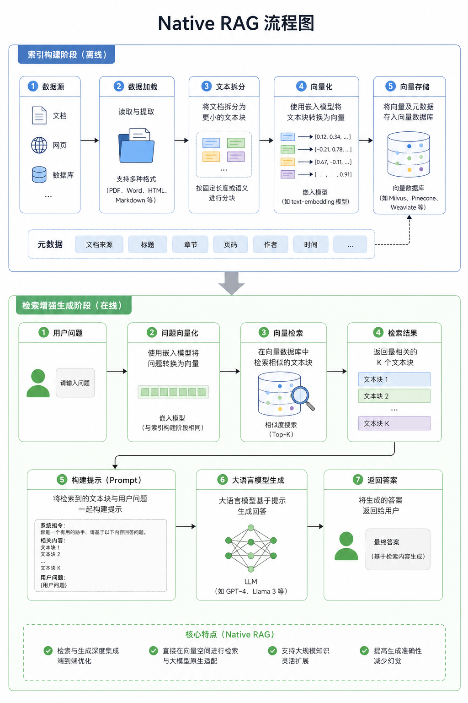
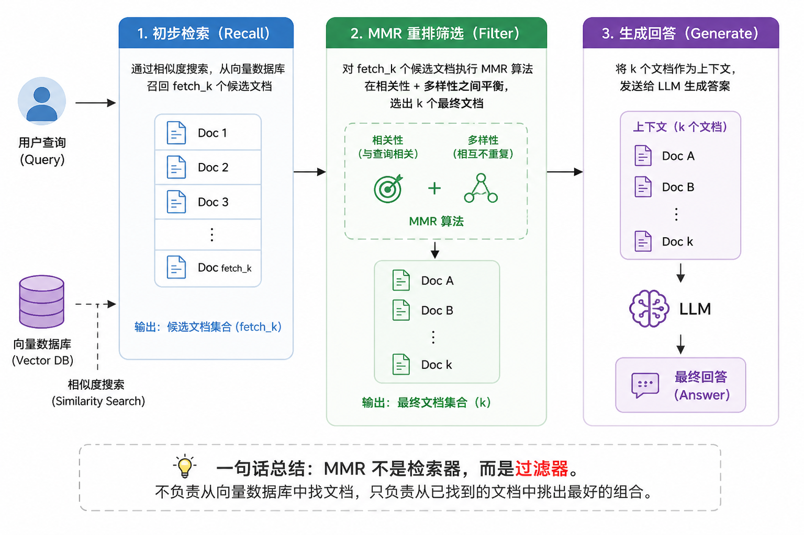
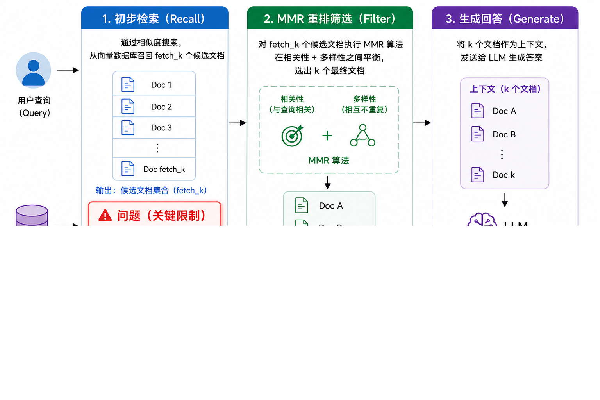
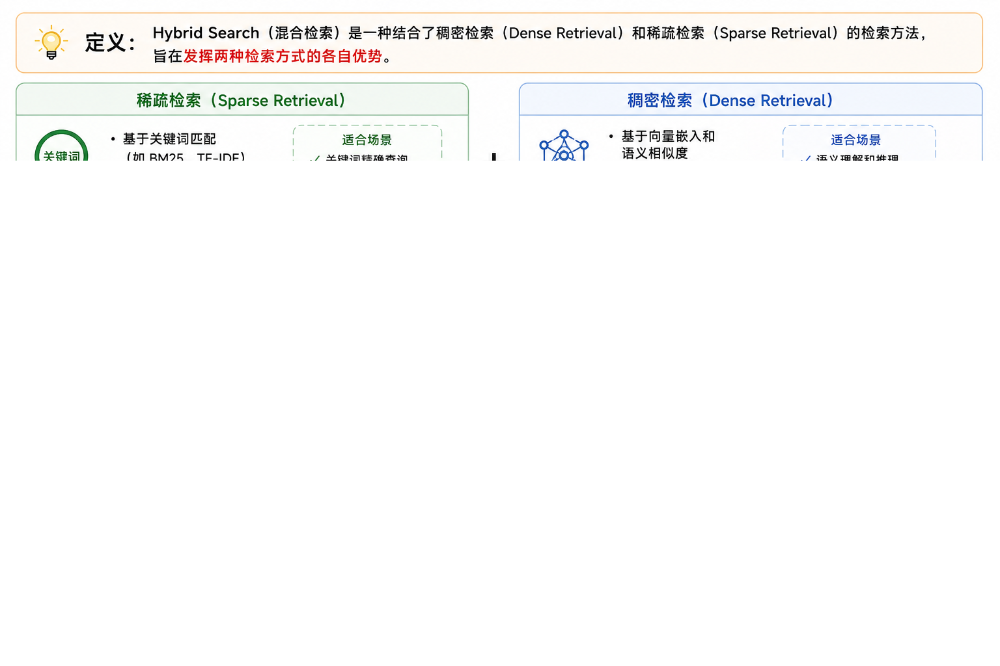
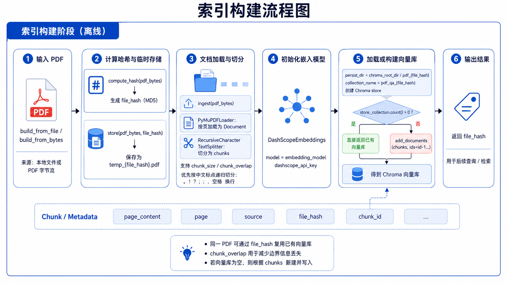
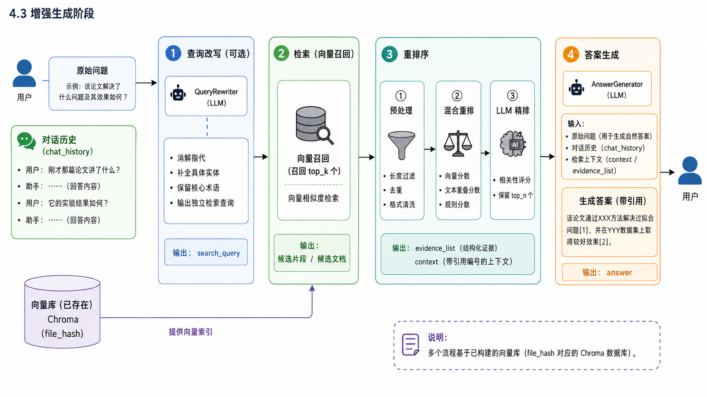
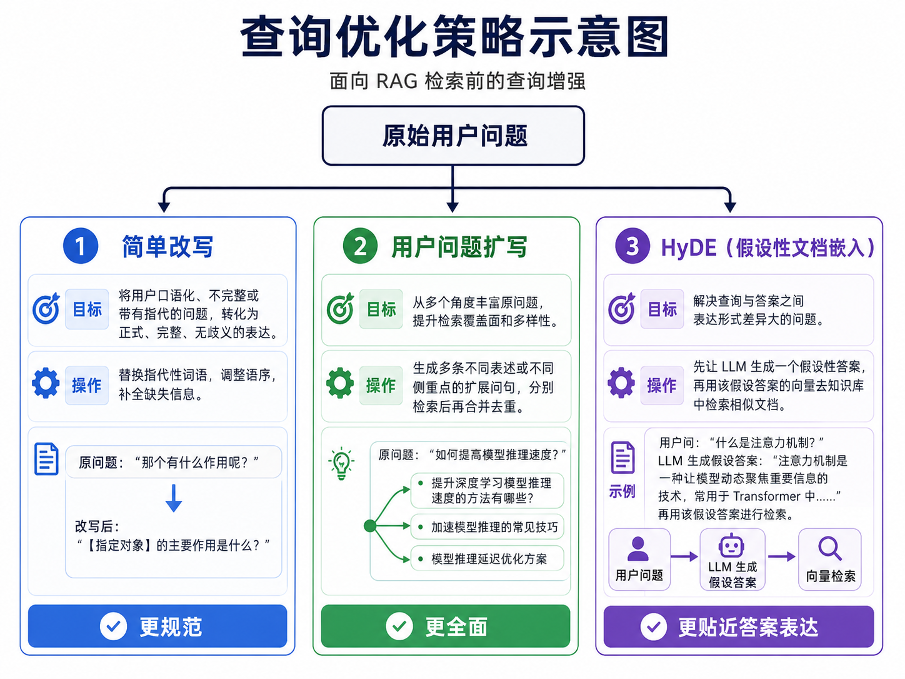
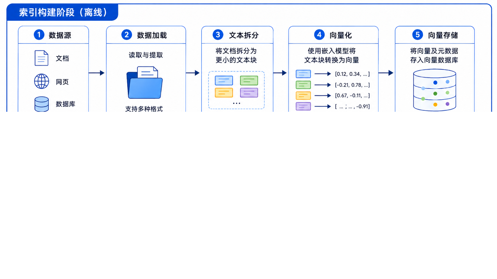

# 「智阅」论文知识库助手

## 1. Native RAG原理



### 1.1. 索引构建阶段

索引构建阶段的目标是准备 RAG 知识库：将原始文档转换为可供检索的向量索引。该阶段包含三个核心步骤：

| 步骤 | 名称       | 作用                           |
| :--- | :--------- | :----------------------------- |
| 1    | 文本拆分   | 将长文档切分为适合处理的文本块 |
| 2    | 文本向量化 | 将文本块转换为数值向量         |
| 3    | 向量存储   | 将向量存入数据库以便检索       |

逻辑流程：原始文档→文档加载 → 文本拆分 → 文本块 → 文本向量化 → 向量存储 → 知识库

#### 1.1.1 文档加载

文档加载需要用到专用的文档加载器，如 TextLoader（文本）、PyMuPDFLoader（PDF）、WebBaseLoader（网页）等。这里以 PyMuPDFLoader 为例介绍 PDF 文档的加载。

```python
from langchain_community.document_loaders import PyMuPDFLoader

file_path = "E:\python\k-ai-knowledge\smart-reading\data\sample_document.pdf"

docs = PyMuPDFLoader(file_path).load()
print(type(docs))  # <class 'list'>
print(len(docs))  # 6
print(type(docs[0]))  # <class 'langchain_core.documents.base.Document'>

for doc in docs:
    print(doc)
"""
1. 每个元素是一个 <class 'langchain_core.documents.base.Document'> 对象
2. 每个对象里面有page_content和metadata元信息，page_content是文档的内容，metadata是元信息
3. 每一个Document是pdf的一页内容
"""
```

#### 1.1.2. 文本拆分

`RecursiveCharacterTextSplitter` 是 LangChain 的默认文本分割器。它的核心工作方式是：维护一个分隔符优先级列表（如 `["\n\n", "\n", "。", "，", " "]`），首先尝试用最高优先级的分隔符将文本切分成大块，如果某个切分出来的块长度仍然超过 `chunk_size`，就**递归地**对该块使用下一个优先级的分隔符继续切分，如此层层深入直至所有块都符合长度要求。这种递归降级的策略确保了在严格遵守长度限制的前提下，尽可能在段落、句子、短语等自然语义边界处进行分割。

> 参考：./data/images/text_splitter.png 的 RecursiveCharacterTextSplitter 分割流程图

```python
原始文本
    │
    ├─ 用 "\n\n" 切 ──→ 段落A（OK）→ 保存
    │
    └─ 段落B（太长！）
            │
            └─ 【递归】对段落B用 "\n" 继续切
                    │
                    ├─ 句子B1（OK）→ 保存
                    │
                    └─ 句子B2（还是太长！）
                            │
                            └─ 【再递归】对句子B2用 "。" 继续切
                                    │
                                    ├─ 分句B2a（OK）
                                    └─ 分句B2b（OK）
```

举例子说明是 RecursiveCharacterTextSplitter 如何切割的：

```python

from langchain_text_splitters import RecursiveCharacterTextSplitter

text = """春秋战国时期是中国历史上思想文化最为繁荣的时代。诸子百家争鸣，儒家、道家、墨家、法家等学派相继兴起。孔子周游列国，宣扬仁义礼智信的思想。老子著《道德经》，阐述无为而治的哲学理念。

秦始皇统一六国后，推行书同文、车同轨、统一度量衡等政策。焚书坑儒虽然巩固了中央集权，但也造成了文化的巨大损失。万里长城的修建抵御了北方游牧民族的侵扰，成为中华民族的象征之一。

唐朝是中国封建社会的鼎盛时期。贞观之治、开元盛世使国力达到顶峰。李白、杜甫等诗人的作品流传千古。丝绸之路的畅通促进了中外经济文化交流。长安城成为当时世界上最大的国际化都市。"""

splitter = RecursiveCharacterTextSplitter(
    chunk_size=55,
    chunk_overlap=8,
    separators=["\n\n", "\n", "。", "，", "、", " ", ""],
    length_function=len
)

chunks = splitter.split_text(text)
for i, chunk in enumerate(chunks):
    print(f"--- 块 {i+1} (长度: {len(chunk)}) ---")
    print(chunk)
    print()
```

**第一步：用 `\n\n` 分割（段落级）**

按空行分割，得到3段：

1. `春秋战国时期是中国历史上思想文化最为繁荣的时代。诸子百家争鸣，儒家、道家、墨家、法家等学派相继兴起。孔子周游列国，宣扬仁义礼智信的思想。老子著《道德经》，阐述无为而治的哲学理念。`
2. `秦始皇统一六国后，推行书同文、车同轨、统一度量衡等政策。焚书坑儒虽然巩固了中央集权，但也造成了文化的巨大损失。万里长城的修建抵御了北方游牧民族的侵扰，成为中华民族的象征之一。`
3. `唐朝是中国封建社会的鼎盛时期。贞观之治、开元盛世使国力达到顶峰。李白、杜甫等诗人的作品流传千古。丝绸之路的畅通促进了中外经济文化交流。长安城成为当时世界上最大的国际化都市。`

检查：每段是否 ≤ 55？

- 段1 > 55 ❌ 继续分割
- 段2 > 55 ❌ 继续分割
- 段3 > 55 ❌ 继续分割

**第二步：用 `\n` 分割（行级）**

段1、段2、段3 内部都没有换行符 `\n`，切不动，换下一级分隔符。

**第三步：用 `。` 分割（句子级）**

声明：分割后的标点 `。` 归后一段开头

段1 用 `。` 分割

原始：春秋战国时期是中国历史上思想文化最为繁荣的时代。诸子百家争鸣，儒家、道家、墨家、法家等学派相继兴起。孔子周游列国，宣扬仁义礼智信的思想。老子著《道德经》，阐述无为而治的哲学理念。

按 `。` 切开，句号归后一段：

| 片段  | 内容                                                   |
| :---: | ------------------------------------------------------ |
| 片段1 | `春秋战国时期是中国历史上思想文化最为繁荣的时代`       |
| 片段2 | `。诸子百家争鸣，儒家、道家、墨家、法家等学派相继兴起` |
| 片段3 | `。孔子周游列国，宣扬仁义礼智信的思想`                 |
| 片段4 | `。老子著《道德经》，阐述无为而治的哲学理念`           |
| 片段5 | `。`                                                   |

合并检查：

- 片段1 + 片段2 = `春秋战国时期...时代` + `。诸子百家...兴起` → 合并 → 块1
- (片段1+2) + 片段3 = 块1 + `。孔子周游...思想` → 不合并（超过55）
- 片段3 + 片段4 = 。孔子周游...思想` + `。老子著...理念 → 合并
- (片段3+4) + 片段5 = `。孔子周游...理念` + `。` → 合并 → 块2

**段1 结果：**

| 块   | 内容                                                         |
| :--- | :----------------------------------------------------------- |
| 块1  | `春秋战国时期是中国历史上思想文化最为繁荣的时代。诸子百家争鸣，儒家、道家、墨家、法家等学派相继兴起` |
| 块2  | `。孔子周游列国，宣扬仁义礼智信的思想。老子著《道德经》，阐述无为而治的哲学理念。` |

为什么块2以 `。` 开头？

因为块1已经合并到上限附近，无法再容纳片段3。片段3以 `。` 开头，和片段4、片段5合并成块2。

---

**段2 用 `。` 分割**

原始：秦始皇统一六国后，推行书同文、车同轨、统一度量衡等政策。焚书坑儒虽然巩固了中央集权，但也造成了文化的巨大损失。万里长城的修建抵御了北方游牧民族的侵扰，成为中华民族的象征之一。

按 `。` 切开，句号归后一段：

| 片段  | 内容                                                         |
| :---: | ------------------------------------------------------------ |
| 片段1 | `秦始皇统一六国后，推行书同文、车同轨、统一度量衡等政策`     |
| 片段2 | `。焚书坑儒虽然巩固了中央集权，但也造成了文化的巨大损失`     |
| 片段3 | `。万里长城的修建抵御了北方游牧民族的侵扰，成为中华民族的象征之一` |
| 片段4 | `。`                                                         |

**合并检查：**

- 片段1 + 片段2 = `秦始皇...政策` + `。焚书坑儒...损失` → 合并 → 块3
- (片段1+2) + 片段3 = 块3 + `。万里长城...之一` → 不合并（超过55）
- 片段3 + 片段4 = `。万里长城...之一` + `。` → 合并 → 块4

**段2 结果：**

|   块    | 内容                                                         |
| :-----: | ------------------------------------------------------------ |
| **块3** | `秦始皇统一六国后，推行书同文、车同轨、统一度量衡等政策。焚书坑儒虽然巩固了中央集权，但也造成了文化的巨大损失` |
| **块4** | `。万里长城的修建抵御了北方游牧民族的侵扰，成为中华民族的象征之一。` |

---

**段3 用 `。` 分割**

原始：唐朝是中国封建社会的鼎盛时期。贞观之治、开元盛世使国力达到顶峰。李白、杜甫等诗人的作品流传千古。丝绸之路的畅通促进了中外经济文化交流。长安城成为当时世界上最大的国际化都市。

按 `。` 切开，句号归后一段：

| 片段  | 内容                                     |
| :---: | ---------------------------------------- |
| 片段1 | `唐朝是中国封建社会的鼎盛时期`           |
| 片段2 | `。贞观之治、开元盛世使国力达到顶峰`     |
| 片段3 | `。李白、杜甫等诗人的作品流传千古`       |
| 片段4 | `。丝绸之路的畅通促进了中外经济文化交流` |
| 片段5 | `。长安城成为当时世界上最大的国际化都市` |
| 片段6 | `。`                                     |

**合并检查：**

- 片段1 + 片段2 + 片段3 = `唐朝...时期` + `。贞观之治...顶峰` + `。李白...千古` → 合并 → 块5
- (片段1+2+3) + 片段4 = 块5 + `。丝绸之路...交流` → 不合并（超过55）
- 片段4 + 片段5 + 片段6 = `。丝绸之路...交流` + `。长安城...都市` + `。` → 合并 → 块6

**段3 结果：**

|  块  | 内容                                                         |
| :--: | ------------------------------------------------------------ |
| 块5  | `唐朝是中国封建社会的鼎盛时期。贞观之治、开元盛世使国力达到顶峰。李白、杜甫等诗人的作品流传千古` |
| 块6  | `。丝绸之路的畅通促进了中外经济文化交流。长安城成为当时世界上最大的国际化都市。` |

---

**完整流程总结**

| 步骤 | 操作            | 结果               |
| :--- | :-------------- | :----------------- |
| ①    | 用 `\n\n` 分割  | 3段，都 > 55，继续 |
| ②    | 用 `\n` 分割    | 无换行，切不动     |
| ③    | 用 `。` 分割段1 | 5片段 → 合并为2块  |
| ④    | 用 `。` 分割段2 | 4片段 → 合并为2块  |
| ⑤    | 用 `。` 分割段3 | 6片段 → 合并为2块  |

---

**最终6个块**

| 块    | 内容                                                         | 开头特征 |
| :---- | :----------------------------------------------------------- | :------- |
| **1** | `春秋战国时期是中国历史上思想文化最为繁荣的时代。诸子百家争鸣，儒家、道家、墨家、法家等学派相继兴起` | 正常     |
| **2** | `。孔子周游列国，宣扬仁义礼智信的思想。老子著《道德经》，阐述无为而治的哲学理念。` | **`。`** |
| **3** | `秦始皇统一六国后，推行书同文、车同轨、统一度量衡等政策。焚书坑儒虽然巩固了中央集权，但也造成了文化的巨大损失` | 正常     |
| **4** | `。万里长城的修建抵御了北方游牧民族的侵扰，成为中华民族的象征之一。` | **`。`** |
| **5** | `唐朝是中国封建社会的鼎盛时期。贞观之治、开元盛世使国力达到顶峰。李白、杜甫等诗人的作品流传千古` | 正常     |
| **6** | `。丝绸之路的畅通促进了中外经济文化交流。长安城成为当时世界上最大的国际化都市。` | **`。`** |

---

🎯 默认情况下，`RecursiveCharacterTextSplitter` 匹配到分隔符时，会在分隔符**前面**切分，导致分隔符跑到下一个块的开头。

**解决方法**：用正则表达式的**正向肯定预查 `(?<=...)`**，让匹配的位置从“分隔符本身”变成“分隔符后面的位置”。

**具体做法**：把 `separators` 从 `["。", "！", "？"]` 改成 `["(?<=。)", "(?<=！)", "(?<=？)"]`，同时设置 `is_separator_regex=True`。

```python
from langchain_text_splitters import RecursiveCharacterTextSplitter

# 测试文本（更长一些）
text = "今天天气很好。我们去吃饭！你觉得怎么样？走吧。明天还要上班。记得早起！"

print("=" * 60)
print("原始文本:", text)
print(f"文本长度: {len(text)} 字符")
print("=" * 60)

# ===== 模式1：False（普通字符串，切掉标点）=====
splitter1 = RecursiveCharacterTextSplitter(
    separators=["。", "！", "？"],
    is_separator_regex=False,
    chunk_size=10,   # 改小，强制切分
    chunk_overlap=0,
)
chunks1 = splitter1.split_text(text)
print("\n【is_separator_regex=False】切分结果:")
for i, chunk in enumerate(chunks1, 1):
    print(f"  块{i}: '{chunk}'")

# ===== 模式2：True（正则表达式，保留标点）=====
splitter2 = RecursiveCharacterTextSplitter(
    separators=["(?<=。)", "(?<=！)", "(?<=？)"],
    is_separator_regex=True,
    chunk_size=10,   # 同样改小
    chunk_overlap=0,
)
chunks2 = splitter2.split_text(text)
print("\n【is_separator_regex=True】切分结果:")
for i, chunk in enumerate(chunks2, 1):
    print(f"  块{i}: '{chunk}'")
```

```python
============================================================
原始文本: 今天天气很好。我们去吃饭！你觉得怎么样？走吧。明天还要上班。记得早起！
文本长度: 35 字符
============================================================

【is_separator_regex=False】切分结果:
  块1: '今天天气很好'
  块2: '。我们去吃饭'
  块3: '！你觉得怎么样？走吧'
  块4: '。明天还要上班'
  块5: '。记得早起！'

【is_separator_regex=True】切分结果:
  块1: '今天天气很好。'
  块2: '我们去吃饭！'
  块3: '你觉得怎么样？走吧。'
  块4: '明天还要上班。'
  块5: '记得早起！'
```

---

🎯 `chunk_overlap` 什么时候会生效？

**一句话总结：`chunk_overlap` 只在需要【强制按字符切分】时才会生效。**

当某个最小的不可再分单元（比如一个没有分隔符的超长单词、或按最后分隔符 `""` 切出的单个字符）本身的长度已经超过了 `chunk_size` 时，分割器会启动“保底策略”，强行按 `chunk_size` 切割这个单元，此时 `chunk_overlap` 就会生效，用于控制相邻两个强制切分片段之间的重叠字符数。

```python
from langchain_text_splitters import RecursiveCharacterTextSplitter

# 测试文本：一个没有空格和标点的超长字符串
text = "这是一个超长超长超长超长超长超长超长超长超长超长超长超长超长超长超长的单词"

# 创建分割器
splitter = RecursiveCharacterTextSplitter(
    chunk_size=20,  # 每个块最大20个字符
    chunk_overlap=5,  # 块之间重叠5个字符
    separators=[" ", ""],  # 先尝试按空格切，最后按字符切
    length_function=len
)
# 执行分割
chunks = splitter.split_text(text)

for i, chunk in enumerate(chunks):
    print(f"\n--- 块 {i + 1} (长度: {len(chunk)}) ---")
    print(f"内容: {chunk}")
    print("-" * 40)
```

```python
块1: [────────────────────────]
     这是一个超长超长超长超长超长超长超长超长
                           [-----]  ← 末尾5字符: "长超长超长"
                              ↓↓↓↓↓
块2:                      [────────────────────────]
                          长超长超长超长超长超长超长超长超长超长的
                           [-----]  ← 开头5字符: "长超长超长"
                          相同的5个字符 = 重叠 ✅
                    
--------------------------------------------------------------------------------------
块2:                           [────────────────────────]
                               长超长超长超长超长超长超长超长超长超长的
                                                [-----]  ← 末尾5字符: "超长超长的"
                                                   ↓↓↓↓↓
块3:                                           [────────]
                                               超长超长的单词
                                                [-----]  ← 开头5字符: "超长超长的"
                                               相同的5个字符 = 重叠 ✅
```

**🔢 重叠关系**

| 块对      | 重叠字符       | 重叠长度 |
| :-------- | :------------- | :------- |
| 块1 ↔ 块2 | `"长超长超长"` | 5字符    |
| 块2 ↔ 块3 | `"超长超长的"` | 5字符    |

#### 1.1.3. 文本向量化

**1.什么是文本向量化**

​		顾名思义，就是将一段文本转换成一段向量（即一个 float 类型的列表、List[float]）。其目标是把一个词、一句话或一篇文章，映射成一个高维空间中的数值向量。在这个空间里，语义越相似的文本，其对应的向量在几何上就越接近（例如余弦相似度更高）。举例来说，“猫坐在垫子上”与“一只猫在垫子上休息”这两句话语义相近，它们的向量在空间中的夹角很小，余弦相似度接近1；而“猫坐在垫子上”与“今天天气很好”语义无关，其向量近乎垂直，余弦相似度接近0。 

举例说明（假设是二维空间，实际是高维空间）：

为了便于理解，假设以下三句话经过文本向量化后，被映射到了一个二维坐标系中，坐标如下：

- “猫坐在垫子上” → (0.98, 0.20)
- “一只猫在垫子上休息” → (0.95, 0.31)
- “今天天气很好” → (0.10, -0.99)

在二维坐标系中：

- 前两个点 (0.98, 0.20) 和 (0.95, 0.31) 位置非常接近，说明它们的语义相近。
- 第三个点 (0.10, -0.99) 远离前两个点，说明它的语义与前两者无关。

计算向量夹角（余弦相似度）：

- 前两个向量夹角很小 → 余弦相似度接近 1（语义相近）
- 与第三个向量的夹角接近 90° → 余弦相似度接近 0（语义无关）

**注意：** 实际应用中，向量维度通常很高（如1536维），这里为了直观理解，假设为二维。

**2. 如何实现文本向量化？**

​		要实现文本向量化，需要借助嵌入模型（embedding model）。例如，我们常使用的阿里云百炼平台，也提供了这类嵌入模型【[链接跳转](https://bailian.console.aliyun.com/cn-beijing?spm=5176.12818093_47.overview_recent.1.3ddb16d0cN2J4j&tab=api#/api/?type=model&url=2712515)】【[向量化-大模型服务平台百炼(Model Studio)-阿里云帮助中心](https://help.aliyun.com/zh/model-studio/embedding)】。

​		具体调用方式如下（以 LangChain 集成 DashScope 为例）：以下代码将输入文本“猫坐在垫子上”转换成了一个长度为1536的浮点数向量。

```python
from langchain_community.embeddings import DashScopeEmbeddings

# 创建模型对象，默认使用 text-embedding-v1
embedding_model = DashScopeEmbeddings()

user_input = "猫坐在垫子上"
result = embedding_model.embed_query(user_input)
print(type(result))  # <class 'list'>
print(len(result))  # 1536
print(result)  # 输出一个包含1536个浮点数的向量列表
```

以下代码将输入文本“猫坐在垫子上”、“一只猫在垫子上休息”和“今天天气很好”批量转换成了三个长度为1536的浮点数向量。

```python
from langchain_community.embeddings import DashScopeEmbeddings

# 创建嵌入模型对象，默认使用 text-embedding-v1
embedding_model = DashScopeEmbeddings()

# 批量处理多个文本
texts = ["猫坐在垫子上", "一只猫在垫子上休息", "今天天气很好"]
results = embedding_model.embed_documents(texts)

# 每个文本被转换成一个1536维的浮点数向量
for text, vector in zip(texts, results):
    print(f"文本：{text}")
    print(f"向量维度：{len(vector)}")
    print(f"向量前5个值：{vector}...\n")
```

**3.测试文本语义与余弦相似度的关系**

根据我们之前所讲的理论：两个文本的语义越相似，它们的向量在空间中的夹角越小，余弦相似度就**越高**。下面通过实际代码来验证这一结论。

```python
from langchain_community.embeddings import DashScopeEmbeddings

def cosine_similarity(a, b):
    """计算余弦相似度"""
    return np.dot(a, b) / (np.linalg.norm(a) * np.linalg.norm(b))


if __name__ == '__main__':
    # 准备三个测试文本：前两个语义相近，第三个语义无关
    texts = ["猫坐在垫子上", "一只猫在垫子上休息", "今天天气很好"]
    vectors = DashScopeEmbeddings().embed_documents(texts)

    # 计算相似度并观察结果
    print(f"'{texts[0]}' 与 '{texts[1]}' 的相似度: {cosine_similarity(vectors[0], vectors[1])}")
    print(f"'{texts[0]}' 与 '{texts[2]}' 的相似度: {cosine_similarity(vectors[0], vectors[2])}")
    print(f"'{texts[1]}' 与 '{texts[2]}' 的相似度: {cosine_similarity(vectors[1], vectors[2])}")

"""
'猫坐在垫子上' 与 '一只猫在垫子上休息' 的相似度: 0.8538658240916893
'猫坐在垫子上' 与 '今天天气很好' 的相似度: 0.14364446118433744
'一只猫在垫子上休息' 与 '今天天气很好' 的相似度: 0.12993993443880203
"""
```

|                 文本对                 | 语义关系 | 余弦相似度 |
| :------------------------------------: | :------- | :--------- |
| “猫坐在垫子上” vs “一只猫在垫子上休息” | 相近     | 0.8539     |
|    “猫坐在垫子上” vs “今天天气很好”    | 无关     | 0.1436     |
| “一只猫在垫子上休息” vs “今天天气很好” | 无关     | 0.1299     |

**4.总结**

文本向量化的本质

- 将文本（词、句子、文章）转换为固定长度的浮点数列表（向量）
- 核心目标：将文本映射到高维空间，使语义相似的文本在几何上彼此接近

实现方式

- 需要借助嵌入模型（Embedding Model）
- 以阿里云百炼平台的 `text-embedding-v1` 为例
- 支持单个文本（`embed_query`）和批量文本（`embed_documents`）两种调用方式
- 输出向量维度为 1536

结论： 语义相近的文本，余弦相似度较高；语义无关的文本，余弦相似度接近 0。理论得到了实验验证。

#### 1.1.4. 向量数据库的存储

文本向量化完成后，需要将向量存储到向量数据库中，以便后续进行相似度检索。常见的向量数据库包括 Chroma、Milvus、Qdrant 等。

| 数据库 | 特点       | 适用场景           | 注意事项           |
| :----- | :--------- | :----------------- | :----------------- |
| Chroma | 轻量、简单 | 开发测试、本地调试 | 生产环境不建议     |
| Milvus | 功能强大   | 企业生产环境       | 部署较重、维护复杂 |
| Qdrant | 性能均衡   | 中小规模生产       | 部署相对简单       |

本次项目选择 Chroma，主要用于开发测试阶段的向量存储与检索操作。

1. 如果没有安装，就先安装：

   `pip install -i https://mirrors.tuna.tsinghua.edu.cn/pypi/web/simple langchain-chroma chromadb`。

2. 基于Chroma完成增加、删除、查询：[smart-reading/test/5_chroma的基本使用.ipynb ](https://gitee.com/he-wenlin/k-ai-knowledge/blob/master/smart-reading/test/5_chroma的基本使用.ipynb)

##### 1.1.4.1. 相似度算法

[相似度计算有哪些方式？](./相似度算法.md)

### 1.2. 检索增强生成阶段

检索增强生成（Retrieval-Augmented Generation, RAG）阶段的核心，是将**用户提问**与**向量数据库中检索到的相关内容**相结合，再交由大语言模型生成最终答案。

**核心流程如下：**

```python
用户提问：「猫在哪？」
        │
        ▼
┌───────────────────────────────────────┐
│  1. 向量检索                            │
│  - 将用户提问转换为向量（Embedding）      │
│  - 在向量数据库中检索相似度最高的 Top-K  │
│    相关内容（如文档片段）                │
└───────────────────────────────────────┘
        │
        ▼
┌───────────────────────────────────────┐
│  2. 构建增强提示                        │
│  - 将检索到的内容作为上下文              │
│  - 组合成最终 Prompt：                  │
│    「基于以下内容回答：...               │
│      用户问题：...」                    │
└───────────────────────────────────────┘
        │
        ▼
┌───────────────────────────────────────┐
│  3. 生成答案                            │
│  - 将增强后的 Prompt 发给大语言模型      │
│  - LLM 结合上下文生成准确答案            │
└───────────────────────────────────────┘
        │
        ▼
      答案：「猫在垫子上休息」
```

**关键点总结：**

| 步骤     | 描述                                                  |
| :------- | :---------------------------------------------------- |
| **检索** | 从向量数据库中召回与用户提问语义最相关的 Top-K 片段   |
| **融合** | 将检索到的内容与用户提问、提示词模板组合成增强 Prompt |
| **生成** | 大语言模型基于增强 Prompt 生成准确、有依据的回答      |

> 🎯 **RAG 的核心价值**：让大语言模型**不依赖自身训练记忆**，而是基于**实时检索到的外部知识**生成答案，从而减少幻觉、增强可解释性、支持知识更新。

## 2. MMR

### 2.1. 为什么需要 MMR？

在讲解MMR是什么之前，我们先来看一下如下代码：

```python
from langchain_community.embeddings import DashScopeEmbeddings
from langchain_chroma import Chroma
from langchain_core.documents import Document

if __name__ == '__main__':
    # 用户查询
    user_query = "如何学习人工智能？"

    # 向量数据库中存储的文本内容
    documents = [
        "学习AI需要先掌握线性代数、概率论和微积分，这是算法的基础",
        "人工智能的核心数学知识包括矩阵运算、概率统计和导数计算",
        "Python是AI开发的首选语言，需要熟悉numpy、pandas等数据处理库",
        "通过Kaggle竞赛实战，从泰坦尼克号预测等项目开始练手",
        "推荐李飞飞的CS231n课程和《深度学习》花书，系统学习理论",
        "如何做红烧肉，需要准备五花肉、冰糖和生抽",
    ]

    # 转换为 Document 对象
    data = [Document(page_content=doc) for doc in documents]

    # 创建 Chroma 客户端并存入文档
    chroma_db = Chroma(
        collection_name="ai_learning",
        embedding_function=DashScopeEmbeddings(),
        persist_directory="./chroma_db",
        collection_metadata={"hnsw:space": "cosine"}
    )

    # 添加文档
    chroma_db.add_documents(
        documents=data,
        ids=[f"id-{i}" for i in range(len(data))]
    )

    # 计算查询与各文本的相似度（使用 Chroma 检索）
    print(f"=== 查询 Q: '{user_query}' ===")
    print("-" * 65)

    # 获取所有文档及其相似度
    results = chroma_db.similarity_search_with_relevance_scores(user_query, k=len(documents))

    for i, (doc, score) in enumerate(results):
        print(f"文档{i}: '{doc.page_content[:30]}...' 相似度: {score:.4f}")
```

代码结果运行如下：

```python
=== 查询 Q: '如何学习人工智能？' ===
-----------------------------------------------------------------
文档0: '学习AI需要先掌握线性代数、概率论和微积分，这是算法的基础...' 相似度: 0.7319
文档1: '人工智能的核心数学知识包括矩阵运算、概率统计和导数计算...' 相似度: 0.5973
文档2: 'Python是AI开发的首选语言，需要熟悉numpy、pan...' 相似度: 0.5797
文档3: '推荐李飞飞的CS231n课程和《深度学习》花书，系统学习理论...' 相似度: 0.5062
文档4: '通过Kaggle竞赛实战，从泰坦尼克号预测等项目开始练手...' 相似度: 0.2974
文档5: '如何做红烧肉，需要准备五花肉、冰糖和生抽...' 相似度: 0.1237
```

假设我们现在需要选择`K=3`个文档，那么我们基于`相似度检索`选中的文本就是：文档0、文档1、文档2。

| 选中  | 内容       | 说明                                          |
| :---- | :--------- | :-------------------------------------------- |
| 文档0 | 数学基础A  | ✅ 相关                                        |
| 文档1 | 数学基础B  | **⚠️ 与文档0高度冗余（都是和数学相关的内容）** |
| 文档2 | Python编程 | ✅ 相关                                        |

**问题分析：**

> **问题1：信息冗余**
>
> - 文档0和文档1都在讲“数学基础”
> - 两段内容高度相似，本质上是在重复同一个信息
>
> **问题2：上下文浪费**
>
> - 如果只有3个上下文位置给大模型
> - 实际上只提供了2个有效信息维度：数学 + Python
>
> **问题3：信息不全面**
>
> - 用户问的是“如何学习人工智能”
> - 丢失了“课程推荐”（文档4）、“实战项目”（文档3）等有价值的信息

**为什么会出现这种情况？**

因为向量检索只关心“相关性”，不关心“重复性”。当数据库中存在多个与用户查询高度相似、但彼此表达意思相同的片段时，检索结果就会全部包含它们，导致信息冗余。

**为了解决这个问题，接下来我们要讲解：MMR（最大边际相关性）**

### 2.2. 什么是 MMR？

在检索增强生成（RAG）中，**MMR（最大边际相关性，Maximum Marginal Relevance）** 是一种用于平衡检索结果“**相关性**”与“**多样性**”的排序与选择算法。

简单来说，它的核心思想是：在选择要返回给大模型（LLM）的文本片段时，既要保证每个片段与问题的相关度高，又要避免这些片段之间过于相似（冗余）。

---

**MMR 在 RAG 流程中的步骤**



| 参数      | 含义                                        |
| :-------- | :------------------------------------------ |
| `fetch_k` | 从向量数据库中初步检索返回的候选文档数量    |
| `k`       | 经过 MMR 算法重排筛选后，最终返回的文档数量 |

----

现在的向量数据库其实都支持 MMR，比如 Chroma 的 MMR 操作如下：

```python
from langchain_community.embeddings import DashScopeEmbeddings
from langchain_chroma import Chroma
from langchain_core.documents import Document
import numpy as np


def cosine_similarity(a, b):
    """计算余弦相似度"""
    return np.dot(a, b) / (np.linalg.norm(a) * np.linalg.norm(b))


if __name__ == '__main__':
    # 1. 准备文档数据
    documents = [
        "学习AI需要先掌握线性代数、概率论和微积分，这是算法的基础",
        "人工智能的核心数学知识包括矩阵运算、概率统计和导数计算",
        "Python是AI开发的首选语言，需要熟悉numpy、pandas等数据处理库",
        "通过Kaggle竞赛实战，从泰坦尼克号预测等项目开始练手",
        "推荐李飞飞的CS231n课程和《深度学习》花书，系统学习理论",
        "如何做红烧肉，需要准备五花肉、冰糖和生抽",
    ]

    # 转换为 Document 对象
    data = [Document(page_content=doc) for doc in documents]

    # 2. 创建 Chroma 客户端并存入文档（显式指定余弦相似度）
    chroma_db = Chroma(
        collection_name="ai_learning",
        embedding_function=DashScopeEmbeddings(),
        persist_directory="./chroma_db",
        collection_metadata={"hnsw:space": "cosine"}  # 指定使用余弦相似度
    )

    # 添加文档
    chroma_db.add_documents(
        documents=data,
        ids=[f"id-{i}" for i in range(len(data))]
    )
    print("文档已存入 Chroma 数据库")
    print("-" * 65)

    # 3. 用户查询
    user_query = "如何学习人工智能？"

    # 4. 普通相似度检索（k=3）
    print(f"=== 查询 Q: '{user_query}' ===")
    print("\n【普通相似度检索 results】")
    results = chroma_db.similarity_search_with_relevance_scores(user_query, k=3)

    for i, (doc, score) in enumerate(results):
        print(f"排名{i + 1}: 相似度={score:.4f} | 内容: {doc.page_content[:40]}...")

    print("\n" + "=" * 65)

    # 5. MMR 检索（k=3，fetch_k=5）
    print("\n【MMR 检索 results】")
    mmr_results = chroma_db.max_marginal_relevance_search(
        query=user_query,
        k=3,  # 最终返回 3 个，top-k
        fetch_k=5,  # 候选池 5 个
        lambda_mult=0.6  # 平衡参数
    )

    for i, doc in enumerate(mmr_results):
        print(f"排名{i + 1}: 内容: {doc.page_content[:40]}...")
```

结果如下：

```python
文档已存入 Chroma 数据库
-----------------------------------------------------------------
=== 查询 Q: '如何学习人工智能？' ===

【普通相似度检索 results】
排名1: 相似度=0.7319 | 内容: 学习AI需要先掌握线性代数、概率论和微积分，这是算法的基础...
排名2: 相似度=0.5973 | 内容: 人工智能的核心数学知识包括矩阵运算、概率统计和导数计算...
排名3: 相似度=0.5797 | 内容: Python是AI开发的首选语言，需要熟悉numpy、pandas等数据处理库...

=================================================================

【MMR 检索 results】
排名1: 内容: 学习AI需要先掌握线性代数、概率论和微积分，这是算法的基础...
排名2: 内容: Python是AI开发的首选语言，需要熟悉numpy、pandas等数据处理库...
排名3: 内容: 推荐李飞飞的CS231n课程和《深度学习》花书，系统学习理论...
```

可以看到：

| 对比项    | 普通相似度检索（k=3） | MMR 检索（k=3，fetch_k=5，lambda_mult=0.6） |
| :-------- | :-------------------- | :------------------------------------------ |
| **排名1** | 数学基础A（0.7319）   | 数学基础A                                   |
| **排名2** | 数学基础B（0.5973）   | Python编程                                  |
| **排名3** | Python编程（0.5797）  | 课程+书籍推荐                               |

- **普通相似度检索**：返回的前3个文档中，文档0和文档1都在讲解“数学基础”，内容高度冗余，导致有效信息维度只有2个（数学 + Python）
- **MMR 检索**：跳过了与文档0高度相似的文档1（数学基础B），选择了文档4（课程+书籍推荐），使最终结果覆盖了3个不同维度：数学基础 + Python编程 + 课程推荐。**在保证相关性的前提下增加了检索结果的多样性。**

---

### 2.3. MMR 的作用阶段

MMR 并非在初次检索时使用，而是在重排阶段发挥作用。

### 2.4. MMR 底层实现

[MMR是如何工作的?](./MMR是如何工作的.md)

## 3. Hybrid Search

### 3.1. 为什么需要 Hybrid Search？

前面我们学习了 MMR，它通过在重排阶段对检索结果进行筛选，解决了向量检索的“信息冗余”问题——确保返回的结果既有相关性又有多样性。但是，向量检索在**初步检索阶段**本身还有一个更根本的问题：**它只能理解语义，无法精确匹配关键词。**



---

例如如下代码：

```python
from langchain_community.embeddings import DashScopeEmbeddings
import numpy as np


def cosine_similarity(a, b):
    return np.dot(a, b) / (np.linalg.norm(a) * np.linalg.norm(b))


if __name__ == '__main__':
    user_query = "GPT-4 参数量"

    documents = [
        "GPT-4 是OpenAI发布的大语言模型，拥有约1.76万亿个参数",
        "GPT-3 的参数规模为1750亿，参数量比较大，是当时最大的语言模型之一",
        "GPT-3.5 的参数规模为1750亿，相比GPT-3有显著提升",
        "GPT-2 的参数规模为15亿，在当时已经是非常大的模型",
        "大语言模型的参数量直接影响推理能力",
    ]

    embeddings = DashScopeEmbeddings()
    query_vector = embeddings.embed_query(user_query)
    doc_vectors = embeddings.embed_documents(documents)

    print(f"=== 查询 Q: '{user_query}' ===")
    print("-" * 65)
    for i, doc in enumerate(documents):
        sim = cosine_similarity(query_vector, doc_vectors[i])
        print(f"文档{i}: '{doc[:35]}...' 相似度: {sim:.4f}")
```

代码运行结果如下：

```python
=== 查询 Q: 'GPT-4 参数量' ===
-----------------------------------------------------------------
文档0: 'GPT-4 是OpenAI发布的大语言模型，拥有约1.76万亿个参数...' 相似度: 0.5820
文档1: 'GPT-3 的参数规模为1750亿，参数量比较大，是当时最大的语言模型...' 相似度: 0.5983
文档2: 'GPT-3.5 的参数规模为1750亿，相比GPT-3有显著提升...' 相似度: 0.6099
文档3: 'GPT-2 的参数规模为15亿，在当时已经是非常大的模型...' 相似度: 0.6114
文档4: '大语言模型的参数量直接影响推理能力...' 相似度: 0.2231
```

**按相似度排序：**

| 排名 | 文档  | 内容     | 相似度 | 说明       |
| :--- | :---- | :------- | :----- | :--------- |
| 1    | 文档3 | GPT-2    | 0.6114 | ❌ 错误答案 |
| 2    | 文档2 | GPT-3.5  | 0.6099 | ❌ 错误答案 |
| 3    | 文档1 | GPT-3    | 0.5983 | ❌ 错误答案 |
| 4    | 文档0 | GPT-4    | 0.5820 | ✅ 正确答案 |
| 5    | 文档4 | 通用表述 | 0.2231 | ⚠️ 部分相关 |

**问题现象：**用户问的是“GPT-4 参数量”，但向量检索返回的前三名分别是 GPT-2、GPT-3.5、GPT-3，正确答案 GPT-4 只排到了第四位。向量检索无法精确区分“GPT-4”和“GPT-2/3/3.5”等相近词，导致大量类似但错误的文档被排在前面。

**根本原因：**向量检索基于语义相似度，它认为所有“GPT-X”系列模型在语义上非常接近（都是大语言模型），加上文档中都有“参数规模”等关键词，导致各种版本的 GPT 都被当作高相似度结果，正确答案反而被淹没了。

**一句话总结：**向量检索“认出了”GPT 家族，但“分不清”具体是哪个版本——当用户需要精确匹配“GPT-4”时，GPT-2、GPT-3 都成了干扰项。

---

**如何解决以上问题呢？**既然**向量检索**擅长语义理解但不擅长精确匹配，而**关键词检索**擅长精确匹配但不理解语义，那么最直接的思路就是**将两者结合起来**——在初步检索阶段，同时执行向量检索和关键词检索，然后将两种结果融合，取长补短。这就是接下来要介绍的：**Hybrid Search（混合检索）**。

### 3.2. 什么是 Hybrid Search



| 检索方式 | 原理                                     | 优点                         | 缺点                                           |
| :------- | :--------------------------------------- | :--------------------------- | :--------------------------------------------- |
| 稀疏检索 | 基于关键词匹配（如 BM25、TF-IDF）        | 精确匹配关键词、可解释性强   | 无法理解语义同义词（如搜索“汽车”找不到“轿车”） |
| 稠密检索 | 基于向量嵌入和语义相似度（如向量数据库） | 理解语义、处理同义词和近义词 | 可能偏离精确关键词、对长尾词不敏感             |

## 4. 论文知识库助手开发

### 4.1. 目录结构

```python
smart-reading /
│
├── indexing/                    # 索引相关（离线构建向量库）
│   ├── __init__.py
│   ├── storage.py               # PDF临时存储 + 哈希计算
│   ├── ingest.py                # 加载 + 切分
│   ├── vectorstore.py           # 向量库构建/加载
│   └── indexing_pipeline.py     # 索引构建流水线（主逻辑）
│
├── querying/                    # 在线检索+生成
│   ├── __init__.py
│   ├── rewrite.py               # 查询改写+重排
│   ├── answer.py                # 答案生成
│   ├── qa_service.py            # 服务编排
│   └── utils.py                 # 兼容层
│
├── common/                      # 共享配置和工具
│   ├── __init__.py
│   ├── config.py                # 原 config.py
│   └── trace.py                 # 原 trace.py（可选，先不加）
│
├── app.py                       # Streamlit前端
├── requirements.txt
└── README.md
```

### 4.2. 索引构建阶段

```python
# 代码实现
class IndexingPipeline:
    def __init__(self, config: QaConfig):
        self.config = config
        self.store = PdfBytesStore()
        self.ingestor = PdfIngestor(config)

    def build_from_bytes(self, pdf_bytes: bytes, dashscope_api_key: str) -> str:
        """
        从 PDF 字节构建向量库，返回 file_hash
        :param pdf_bytes: PDF 文件的原始字节
        :param dashscope_api_key: 通义千问 API Key（用于 Embedding）
        :return: 文件 MD5 哈希，可用于后续查询
        """
        # 1. 计算 hash，并且存储临时文件（将hash值作为临时文件的名字）
        file_hash = self.store.compute_hash(pdf_bytes)
        self.store.store(pdf_bytes, file_hash)
        # 2. 加载 & 切分文档
        chunks = self.ingestor.ingest(pdf_bytes)
        # 3. 构建 / 加载向量库（传入 chunks 会新建）
        embeddings = DashScopeEmbeddings(
            model=self.config.embedding_model,
            dashscope_api_key=dashscope_api_key
        )
        vector_store = VectorStoreManager(self.config, embeddings)
        vector_store.load_or_build(file_hash, chunks)

        return file_hash

    def build_from_file(self, pdf_path: str, dashscope_api_key: str) -> str:
        """从文件路径构建索引"""
        with open(pdf_path, "rb") as f:
            pdf_bytes = f.read()
        return self.build_from_bytes(pdf_bytes, dashscope_api_key)
```



### 4.3. 增强生成阶段



---

#### 4.3.1. 查询改写

为什么需要做查询改写呢？这是因为用户问题通常来说比较模糊，比较口语话。比如xxx，或者说用户问题通常具有指代性，比如`那个有什么作用呢？`。如果把用户问题直接向量化，然后去向量数据库做检索，肯定召回的命中率会很低。

 **1. 为什么需要查询改写？**

用户问题往往具有以下特点：

- 用户的**表达模糊、口语化**
- **存在指代不明**：如“那个有什么作用呢？”中的“那个”需要结合上下文才能明确。

若直接将用户原问题向量化并到向量数据库中检索，容易因上述问题导致检索命中率显著下降。因此，**查询改写**（或称为查询重写）成为提升检索效果的关键步骤。

---

**2. 查询改写有哪几种方式呢？**



----

**3.简单改写的代码实现**

```python
class QueryRewriter:
    """查询改写器：把用户问题改写成可独立检索的查询"""

    def __init__(self, llm: ChatTongyi) -> None:
        self.__prompt = ChatPromptTemplate.from_messages([
            ("system", REWRITE_PROMPT),
            MessagesPlaceholder("chat_history"),
            ("human", "原始问题：{question}\n请改为独立检索查询:")
        ])
        self.__llm = llm

    def rewrite(self, question: str, chat_history: List[BaseMessage]) -> str:
        # ...
        # query rewrite逻辑
        try:
            chain = self.__prompt | self.__llm | StrOutputParser()
            return chain.invoke(input={"question": q, "chat_history": chat_history})
        except Exception:
            return q
```

```python
REWRITE_PROMPT = """
你是检索查询改写专家。把用户问题改写成适合在论文知识库中检索的独立查询。
规则：
1) 消除指代（那篇/刚才/它 → 补全具体实体）
2) 保留核心术语（论文名、方法名、技术概念）
3) 只输出改写后的查询，不要解释
"""
```

#### 4.3.2. 检索 - 用改写后的查询进行向量召回

在查询改写之后，下一步就是**检索**——将改写后的用户问题向量化，然后在向量数据库中进行相似度搜索，返回最相似的 `k` 条文档及其相似度分数。

```python
def recall_with_scores(
    query: str,
    vectorstore: Chroma,
    k: int = 30
) -> Tuple[List[Document], List[float]]:
    # similarity_search_with_relevance_scores 返回 List[Tuple[Document, float]]
    results = vectorstore.similarity_search_with_relevance_scores(query, k=k)

    docs = []
    scores = []
    for doc, score in results:
        doc.page_content = doc.page_content.strip()
        docs.append(doc)
        scores.append(score)
    return docs, scores
```

##### 4.3.2.1. 多路召回

其实在这个部分检索的时候可以使用多路检索，即：关键字检索(BM25) + 相似度检索。

#### 4.3.3. 重排序 - rerank精排

##### 4.3.3.1. 为什么要做重排序

这是因为在 RAG 系统中，向量检索虽然能够快速召回大量相关片段，但存在一个根本问题：**向量相似度 ≠ 语义相关性**。

比如以下例子：

```python
=== 查询 Q: 'GPT-4 参数量' ===
-----------------------------------------------------------------
文档0: 'GPT-4 是OpenAI发布的大语言模型，拥有约1.76万亿个参数...' 相似度: 0.5820
文档1: 'GPT-3 的参数规模为1750亿，参数量比较大，是当时最大的语言模型...' 相似度: 0.5983
文档2: 'GPT-3.5 的参数规模为1750亿，相比GPT-3有显著提升...' 相似度: 0.6099
文档3: 'GPT-2 的参数规模为15亿，在当时已经是非常大的模型...' 相似度: 0.6114
文档4: '大语言模型的参数量直接影响推理能力...' 相似度: 0.2231
```

如果按照向量数据库的相似度搜索，那么`k`个数据将会按照如下顺序返回：

```python
文档3: 'GPT-2 的参数规模为15亿，在当时已经是非常大的模型...' 相似度: 0.6114
文档2: 'GPT-3.5 的参数规模为1750亿，相比GPT-3有显著提升...' 相似度: 0.6099
文档1: 'GPT-3 的参数规模为1750亿，参数量比较大，是当时最大的语言模型...' 相似度: 0.5983
文档0: 'GPT-4 是OpenAI发布的大语言模型，拥有约1.76万亿个参数...' 相似度: 0.5820
文档4: '大语言模型的参数量直接影响推理能力...' 相似度: 0.2231
```

----

**但是要记住**：召回结果常包含重复内容，需先过滤去重，再交由 LLM 重排，避免信息冗余与计算浪费。

##### 4.3.3.2. 预处理 - 过滤去重

过滤：去除一些特别短 or 特别长的一些内容。

去重：去除重复的内容。

```python

# ------------------ 预过滤： 长度过滤+ 去重 ------------------
def __filter(self, docs: List[Document], min_len: int = 40, max_len: int = 2000) -> List[Document]:
    """
    过滤掉过短（<min_len）或过长（>max_len）的片段，并去重
    :param docs: 原始文档列表
    :param min_len: 最小字符数
    :param max_len: 最大字符数
    :return: 过滤后的文档列表
    """
    # 基于长度过滤
    filtered = []
    for doc in docs:
        text = doc.page_content
        if min_len <= len(text) <= max_len:
            filtered.append(doc)

    # 基于 page_content 去重，保留第一次出现的文档
    is_contains = set()
    kept = []
    for doc in filtered:
        key = doc.page_content
        if key not in is_contains:
            is_contains.add(key)
            kept.append(doc)

    return kept
```

##### 4.3.3.3. 混合重排 - Jaccard 相似度计算

Jaccard 相似度被用来**衡量两个文本（查询 vs 文档片段）在词汇层面的重叠程度**。

```python
# ------------------ 混合重排：向量分数 + 文本重叠分数 ------------------
def __hybrid_rerank(self, question: str, documents: List[Document],
                    vector_scores: List[float], top_k: int = 12) -> Tuple[List[Document], List[float]]:
    """
    混合重排序：结合向量分数和文本重叠分数，并加入长度/关键词规则
    :param question: 用户问题（用于计算重叠和关键词）
    :param documents: 待重排的文档列表
    :param vector_scores: 对应的向量分数列表
    :param top_k: 保留前 top_k 个
    :return: (排序后的文档列表, 对应的混合分数列表)
    """
    if not documents:
        return [], []
    # 计算每个文档的文本重叠分数
    overlap_scores = [self.__simple_overlap_score(question, doc.page_content) for doc in documents]

    final = []  # 存储 (原始索引, 混合分数)
    for i, (vector_score, overlap_score) in enumerate(zip(vector_scores, overlap_scores)):
        # 混合分数 = 0.3 * 向量分 + 0.7 * 文本重叠分
        hybrid = 0.3 * vector_score + 0.7 * overlap_score
        text = documents[i].page_content
        # 长度规则：果断或过长降权
        if len(text) < 80:
            hybrid *= 0.8
        elif len(text) > 1600:
            hybrid *= 0.9
        # 关键词规则：如果问题和文本有共同单词，适当提权
        if set(question.lower().split()) & set(text.lower().split()):
            hybrid *= 1.1
        final.append((i, hybrid))
    # 按照混合分数降序排序
    final.sort(key=lambda t: t[1], reverse=True)
    idx_sorted = [i for i, _ in final[:top_k]]
    docs_sorted = [documents[i] for i in idx_sorted]
    scores_sorted = [final[i][1] for i in range(top_k) if i < len(final)]
    return docs_sorted, scores_sorted

def __simple_overlap_score(self, query: str, text: str) -> float:
    """
    计算查询与文本的 Jaccard 重叠度（支持中文双字词 + 英文单词）
    :param query: 查询字符串
    :param text: 文本片段
    :return: 重叠度，范围 [0,1]
    """

    def tokens(s: str):
        s = s.lower()
        # 提取连续的中文字符（至少两个）
        chinese = re.findall(r'[\u4e00-\u9fff]{2,}', s)
        # 提取英文单词
        english = re.findall(r'[a-z]+', s)
        # 对中文生成双字 bigram
        bigrams = [ch[i:i + 2] for ch in chinese for i in range(len(ch) - 1)]
        return set(bigrams + english)

    q_tokens = tokens(query)
    t_tokens = tokens(text)
    if not q_tokens:
        return 0.0
    inter = q_tokens & t_tokens
    union = q_tokens | t_tokens
    return len(inter) / len(union) if union else 0.0
```

##### 4.3.3.4. LLM精排 - 使用大模型精排

使用大模型对候选文档进行最终的排序：

```python
# ------------------ LLM 精排：使用大模型打分 ------------------
def __llm_rerank(self, question: str, documents: List[Document], top_n: int = 4) -> Tuple[
    List[Document], List[float]]:
    """
    利用 LLM 对每个候选片段进行 0-10 的打分，并按分数排序取前 top_n
    :param question: 用户问题
    :param documents: 待精排的文档列表
    :param top_n: 最终保留的文档数量
    :return: (排序后的文档列表, LLM 分数列表)
    """
    if not documents:
        return [], []
    scored = []
    for doc in documents:
        score_text = self.__chain.invoke({"question": question, "chunk": doc.page_content})
        # 从 LLM 返回结果中提取数字（可能带小数点）
        try:
            match = re.search(r'(\d+(?:\.\d+)?)', score_text)
            score = float(match.group(1)) if match else 0.0
        except Exception:
            score = 0.0
        scored.append((score, doc))
    # 按分数降序排序
    scored.sort(key=lambda x: x[0], reverse=True)
    docs = [d for _, d in scored[:top_n]]
    scores = [s for s, _ in scored[:top_n]]
    return docs, scores
```

```python
prompt = ChatPromptTemplate.from_messages([
    ("system", RERANK_PROMPT),
    ("human", "问题:{question}\n\n候选片段:\n{chunk}\n\n分数:")
])
self.__llm = llm
self.__chain = prompt | self.__llm | StrOutputParser()

# -------------------------------------
RERANK_PROMPT = "你是一个严谨的检索重排序器。给定问题和候选片段，输出该片段对回答问题的相关性分数（0-10）。只输出数字。"
```

##### 4.3.3.5. 答案生成

答案生成本质上就是调用 LLM 进行回答，将按照以下格式调用：

```python
# 1.system prompt + 2.检索上下文(参考的资料)
READING_HELPER_PROMPT = """
你是一个严谨的论文学习知识库问答助手。只根据给定上下文回答。
答案末尾用 [1][2] 标注引用编号（对应上下文中提供的编号）。
上下文：\n{context}
"""

# 3.用户问题
user: 什么是xxx？
```

## 5. RAG 全流程回顾 - 面试吹




